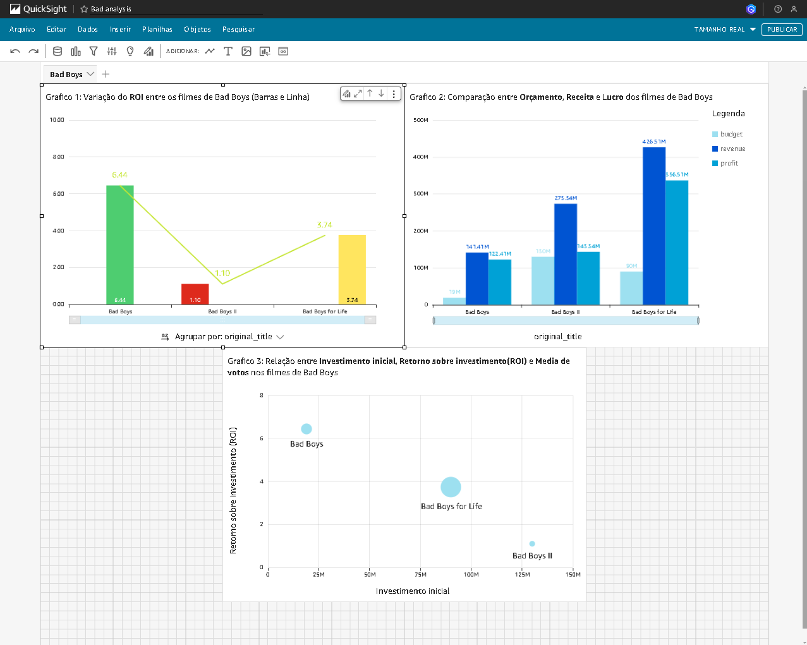

<div align="center">

# Programa de Bolsas Compass UOL — Engenharia de Dados

**10 sprints de formação prática, dos fundamentos de Linux/SQL até um pipeline AWS com Data Lake, Glue/PySpark, Athena e QuickSight.**

[](https://github.com/Mayconxzdev/Estagio-CompassUOL/actions/workflows/validate.yml)


[Case no portfólio](https://mayconxzdev.github.io/cases/compass/) · [Sprint 10](Sprint10) · [Dashboard final](Sprint10/Desafio/Dashboard.png)



</div>

Este repositório registra minha participação no **Programa de Bolsas da Compass UOL**, realizado entre **outubro de 2024 e março de 2025**.

Ao longo de **10 sprints**, avancei dos fundamentos de Git, Linux e SQL até a construção de um pipeline de dados em AWS com ingestão por arquivos e API, Data Lake em camadas, processamento distribuído, consultas analíticas e dashboard.

> O conteúdo representa minha formação prática durante o programa. Não é um ambiente empresarial de produção nem um único produto comercial.

## Visão geral

| Campo | Informação |
|---|---|
| Programa | Programa de Bolsas Compass UOL |
| Período | Out. 2024 – mar. 2025 |
| Duração | Aproximadamente seis meses |
| Organização | 10 sprints |
| Área | Engenharia de Dados |
| Status | Concluído |

## Pipeline que construí

Nas sprints finais, desenvolvi um pipeline para análise de dados de filmes e séries:

```text
Arquivos CSV + API TMDB
          ↓
Python / boto3 / AWS Lambda
          ↓
Amazon S3 — Raw Zone
          ↓
AWS Glue + Apache Spark
          ↓
Trusted Zone — Parquet particionado
          ↓
Refined Zone — modelo dimensional
          ↓
Amazon Athena
          ↓
Amazon QuickSight
```

O fluxo envolveu:

1. ingestão de arquivos CSV em uma estrutura organizada no Amazon S3;
2. consumo da API do TMDB com Python;
3. execução da coleta em AWS Lambda e gravação via boto3;
4. processamento de CSV e JSON com AWS Glue e PySpark;
5. transformação para Parquet e particionamento por data;
6. organização das camadas Raw, Trusted e Refined;
7. modelagem relacional e dimensional, com tabelas fato e dimensão;
8. consultas SQL no Amazon Athena;
9. dashboard analítico no Amazon QuickSight.

## Jornada por sprint

| Sprint | Conteúdo principal |
|---|---|
| [Sprint 1](Sprint1) | Git, GitHub, terminal Linux e controle de versão |
| [Sprint 2](Sprint2) | SQL, consultas, modelagem relacional e dimensional |
| [Sprint 3](Sprint3) | Análise de dados com Python, Pandas e Matplotlib |
| [Sprint 4](Sprint4) | Aplicações Python executadas em containers Docker |
| [Sprint 5](Sprint5) | AWS S3, EC2, boto3, Pandas e Polars |
| [Sprint 6](Sprint6) | Ingestão de CSV para a Raw Zone do Data Lake no S3 |
| [Sprint 7](Sprint7) | API TMDB, AWS Lambda, boto3 e armazenamento JSON no S3 |
| [Sprint 8](Sprint8) | Raw → Trusted com AWS Glue, PySpark, Parquet e particionamento |
| [Sprint 9](Sprint9) | Pipeline ETL, camada Refined e modelagem dimensional |
| [Sprint 10](Sprint10) | Consultas com Athena e dashboard no QuickSight |

## Tecnologias utilizadas

### Linguagens e dados

`Python` · `SQL` · `Pandas` · `Polars` · `PySpark` · `Matplotlib` · `CSV` · `JSON` · `Parquet`

### Engenharia de dados

`ETL` · `Data Lake` · `Raw/Trusted/Refined` · `DataFrames` · `Spark SQL` · `modelagem relacional` · `modelagem dimensional` · `tabelas fato e dimensão`

### AWS

`Amazon S3` · `Amazon EC2` · `AWS Lambda` · `AWS Glue` · `Glue Data Catalog` · `Amazon Athena` · `Amazon QuickSight` · `AWS IAM` · `boto3`

### Desenvolvimento

`Git` · `GitHub` · `Linux` · `Docker`

## Entregas preservadas no repositório

- função Lambda para paginação e coleta de filmes na API TMDB;
- gravação de JSON em caminhos organizados no S3;
- jobs Glue/PySpark para leitura de CSV e JSON;
- remoção de registros incompletos;
- escrita em Parquet particionado por ano, mês e dia;
- preparação das camadas Trusted e Refined;
- consultas Athena e dashboard QuickSight;
- código, anotações e capturas organizados por sprint.

## O que aprendi e pratiquei

- integração entre Python, APIs e serviços AWS;
- construção de pipelines em diferentes camadas;
- processamento com Spark e formatos analíticos;
- modelagem relacional e dimensional;
- consultas analíticas e apresentação de resultados em dashboard;
- documentação da evolução técnica ao longo de entregas sucessivas.

## Estado e limites

- o ambiente AWS utilizado durante o programa não permanece ativo;
- o repositório preserva os exercícios do período e não foi reescrito como produto de produção;
- serviços apenas estudados não são apresentados como experiência operacional avançada;
- não declaro volume, SLA ou ganho de desempenho sem um artefato reproduzível correspondente.

## Autor

**Maycon Ferreira**

Projetos mais recentes: [github.com/Mayconxzdev](https://github.com/Mayconxzdev) · [Portfólio](https://mayconxzdev.github.io/)
