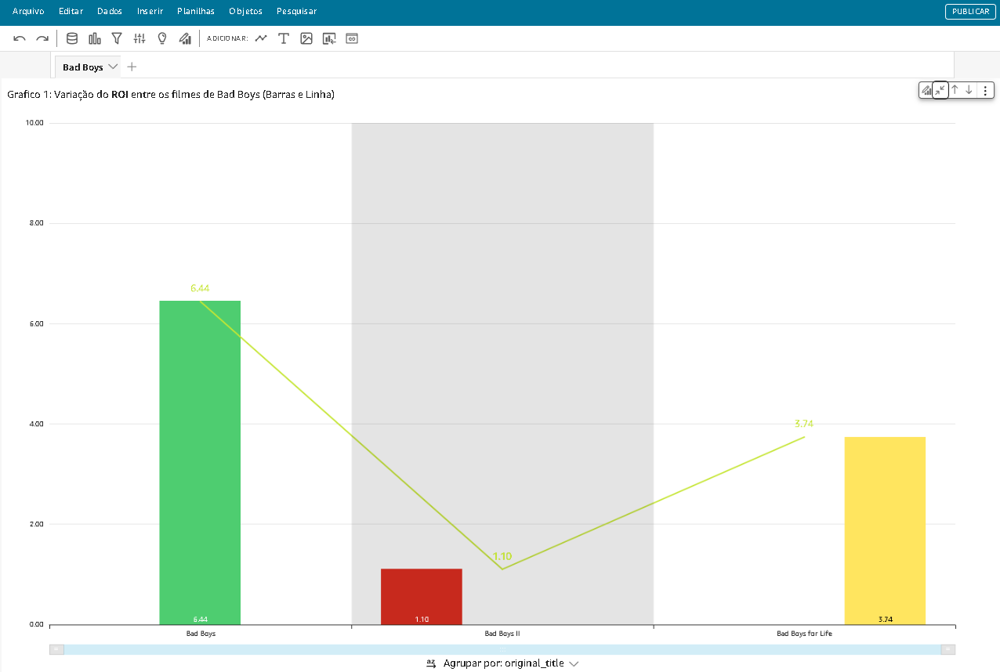
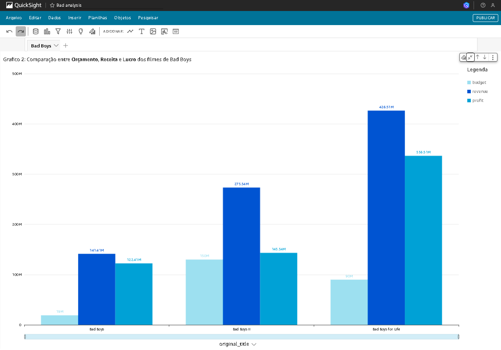
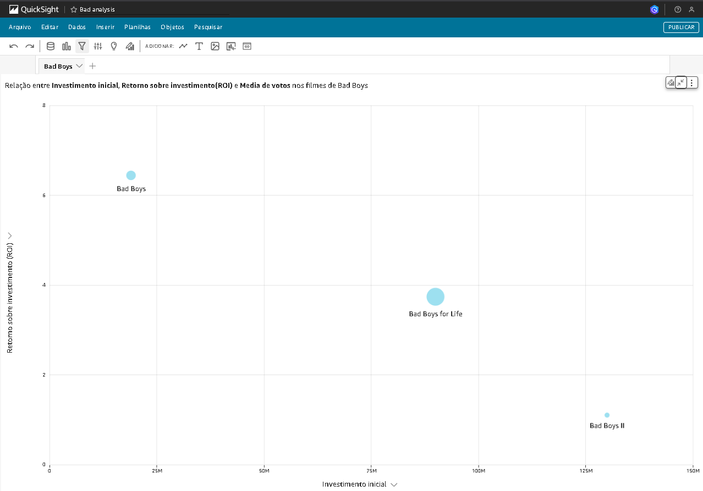

# Desafio de Filmes e Séries - Etapa 5: Análise da Franquia Bad Boys com AWS QuickSight

## Descrição

Este desafio teve como objetivo analisar a franquia de filmes "Bad Boys" utilizando dados processados e armazenados em um data lake na AWS. A análise foi realizada através da criação de um dashboard interativo no AWS QuickSight, que consumiu dados da Camada Refined do data lake, acessados via Amazon Athena.

O foco principal foi explorar o desempenho financeiro e a recepção do público dos filmes da franquia, utilizando três gráficos distintos para apresentar os insights:

## Gráficos e Análise

1.  **Gráfico 1: Variação do ROI entre os filmes de Bad Boys (Barras e Linha)**

    - Este gráfico de barras compara o Retorno sobre Investimento (ROI) dos três filmes da franquia.
    - O objetivo é visualizar a eficiência do investimento em cada filme, mostrando quanto retorno cada dólar investido gerou.
    - **Análise**:
      - "Bad Boys" possui o maior ROI (6.44), indicando um excelente retorno sobre o investimento inicial.
      - "Bad Boys II" apresenta o menor ROI (1.10), sugerindo que o aumento no orçamento não resultou em um retorno proporcionalmente maior.
      - "Bad Boys for Life" tem um ROI intermediário (3.74), demonstrando um bom desempenho financeiro, mas não tão eficiente quanto o primeiro filme.
      - A linha conectando as barras mostra a tendência de queda no ROI ao longo da franquia.

2.  **Gráfico 2: Comparação entre Orçamento, Receita e Lucro dos filmes de Bad Boys**

    - Este gráfico de barras lado a lado compara o orçamento, a receita e o lucro de cada filme da franquia.
    - O objetivo é analisar o sucesso comercial dos filmes, mostrando a relação entre o investimento inicial, a arrecadação em bilheteria e o lucro gerado.
    - **Análise**:
      - "Bad Boys for Life" teve a maior receita (426.51M) e o maior lucro (336.51M), indicando um grande sucesso comercial.
      - "Bad Boys" teve o menor orçamento (19M) e, apesar do menor lucro absoluto (122.41M), demonstra um alto ROI devido ao baixo investimento inicial.
      - "Bad Boys II" teve o maior orçamento (130M) e um lucro de 143.34M, mas o ROI foi o menor, mostrando que o alto investimento não garantiu um retorno tão eficiente.

3.  **Gráfico 3: Relação entre Investimento Inicial, Retorno sobre Investimento (ROI) e Média de votos nos filmes de Bad Boys**

    - Este gráfico de dispersão mostra a relação entre o investimento inicial (orçamento), o ROI e a média de votos dos usuários para cada filme.
    - O objetivo é explorar se há alguma correlação entre o investimento financeiro, o retorno obtido e a avaliação do público.
    - **Análise**:
      - "Bad Boys" tem o menor investimento inicial e o maior ROI.
      - "Bad Boys II" tem o maior investimento inicial e o menor ROI.
      - "Bad Boys for Life" fica em uma posição intermediária em termos de investimento e ROI.
      - O tamanho dos pontos pode representar a média de votos, mas essa informação não está explicitamente clara no gráfico fornecido.

## Tecnologias Utilizadas

- **Amazon S3**: Armazenamento dos dados processados.
- **Amazon Athena**: Execução de consultas SQL nos dados do S3.
- **AWS QuickSight**: Criação do dashboard interativo.
- **AWS Glue**: Processamento e transformação dos dados.

## Conclusão

Este desafio permitiu explorar as capacidades do AWS QuickSight para criar visualizações interativas e extrair insights valiosos a partir de dados complexos. A análise dos três gráficos proporcionou uma compreensão abrangente do desempenho financeiro e da recepção do público da franquia Bad Boys, demonstrando a importância de considerar diferentes métricas ao avaliar o sucesso de um filme.
