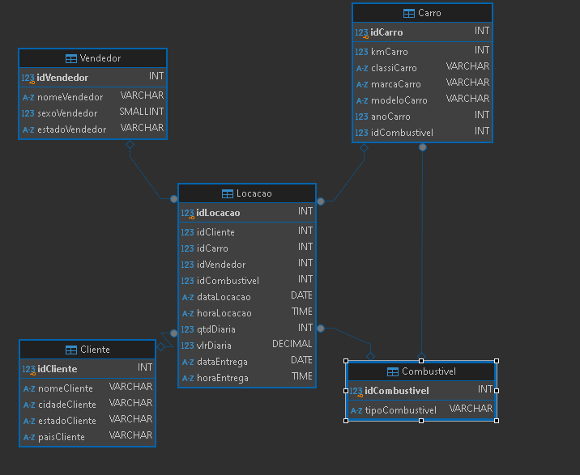
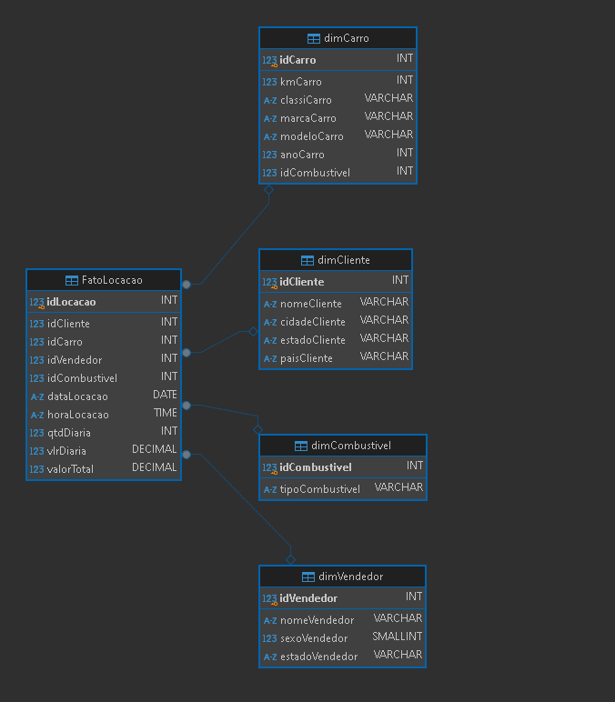

## Criação das Tabelas

### Exemplo

Primeiro, criei as tabelas utilizando o comando CREATE TABLE: [Tabela-carro-criada-no-DBeaver](../Evidencias/Carro.png)

```sql
CREATE TABLE Carro (
  idCarro INT,
  kmCarro INT,
  classiCarro VARCHAR(50),
  marcaCarro VARCHAR(50),
  modeloCarro VARCHAR(50),
  anoCarro INT,
  idCombustivel INT,
  FOREIGN KEY (idCombustivel) REFERENCES Combustivel(idCombustivel) --Usando o FOREIGN KEY para relacionar a tabela Carro com Combustivel
);
```

## Inserção de Dados

Depois de criar todas as tabelas, inseri os dados na tabela tb.locacao utilizando INSERT OR IGNORE INTO para evitar erros de integridade:

### Exemplo

```sql
INSERT OR IGNORE INTO Carro (idCarro, kmCarro, classiCarro, modeloCarro, anoCarro, idCombustivel)
SELECT DISTINCT idCarro, kmCarro, classiCarro, modeloCarro, anoCarro, idCombustivel
from tb_locacao;
```

## Criação das Tabelas de Dimensão e Fato

Criação das Tabelas de Dimensão e Fato

### Exemplo de Tabela Fato [Tabela-FatoLocacao-criada-no-DBeaver](../Evidencias/FatoLocacao.png)

```sql
CREATE TABLE FatoLocacao (
    idLocacao INT PRIMARY KEY,
    idCliente INT,
    idCarro INT,
    idVendedor INT,
    idCombustivel INT,
    dataLocacao DATE,
    horaLocacao TIME,
    qtdDiaria INT,
    vlrDiaria DECIMAL,
    valorTotal DECIMAL(10,2),
    FOREIGN KEY (idCliente) REFERENCES dimCliente(idCliente),
    FOREIGN KEY (idCarro) REFERENCES dimCarro(idCarro),
    FOREIGN KEY (idVendedor) REFERENCES dimVendedor(idVendedor),
    FOREIGN KEY (idCombustivel) REFERENCES dimCombustivel(idCombustivel)
);
```

## Inserção de Dados nas Tabelas de Fato

Os dados foram inseridos nas tabelas de fato a partir das tabelas criadas anteriormente:

### Exemplo

```sql

INSERT INTO FatoLocacao (idLocacao, idCliente, idCarro, idVendedor, idCombustivel, dataLocacao, horaLocacao, qtdDiaria, vlrDiaria, valorTotal)
SELECT
    idLocacao,
    idCliente,
    idCarro,
    idVendedor,
    idCombustivel,
    dataLocacao,
    horaLocacao,
    qtdDiaria,
    vlrDiaria,
    (qtdDiaria * vlrDiaria) AS valorTotal
FROM Locacao;
```

### Exemplo de Tabela Dimensão [Tabela-dimCliente-criado-no-DBeaver](../Evidencias/dimCliente.png)

```sql
CREATE TABLE dimCliente (
    idCliente INT PRIMARY KEY,
    nomeCliente VARCHAR(100),
    cidadeCliente VARCHAR(50),
    estadoCliente VARCHAR(2),
    paisCliente VARCHAR(50)
);
```

## Inserção de Dados nas Tabelas de Dimensão

Os dados foram inseridos nas tabelas de dimensão a partir das tabelas criadas anteriormente:

### Exemplo

```sql
INSERT OR IGNORE INTO dimCliente (idCliente, nomeCliente, cidadeCliente, estadoCliente, paisCliente)
SELECT DISTINCT idCliente, nomeCliente, cidadeCliente, estadoCliente, paisCliente
FROM Cliente;
```

## Criação de Views

As views foram criadas a partir das tabelas de dimensão:

### Exemplo

```sql
CREATE VIEW dimCarroView AS
SELECT idCarro, kmCarro, classiCarro, marcaCarro, modeloCarro, anoCarro, idCombustivel
FROM dimCarro;
```

# Modelo-racional



# Modelo-Dimencional



# Conteúdo das Pastas:

### [SCRIPT COMPLETO DA CRIAÇÃO DAS TABELAS COM A INSERÇÃO](../Desafio/concessionaria/TABLECarro.sql)

### [SCRIPT COMPLETO DA CRIAÇÃO DAS TABELAS DIM E FATO COM A INSERÇÃO](../Desafio/concessionaria/TABLEdimCarro.sql)
